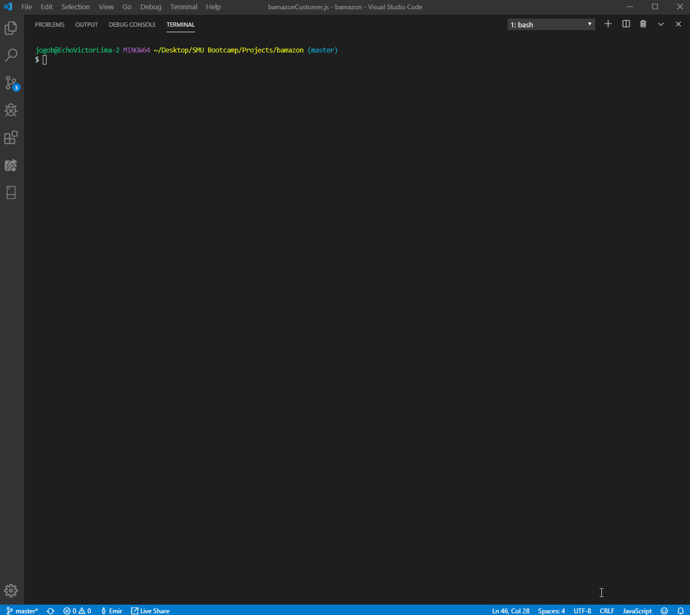

# Bamazon Node App

Bamazon is a command line Node.js and MySQL App that let's the user purchase products that are stored in a SQL

## Technologies Used
- JavaScript
- Node.js
- MySQL
- NPM's
- Terminal to run App

## What Bamazon can currently do
* User gets a table of products for sale, user can chose which to purchase
* User then can chose the quantity of purchase
* User get's total amount due after successful purchase

### Organization in JavaScript file
1. Code for required NPM packages used.
2. Code to establish connection with MySQL database (Has to input a password for MySQL).
3. Code with functions that execute depending on what the user selects to do.

### How To Run App

1. App has to be run on the command terminal
    - $ node bamazonCustomer.js
2. User will then connect to MySQL database and available products displayed on a table in terminal
3. User selects which unique item_id they want to purchase
4. App then asks user the quantity they which to purchase
5. If enough product in stock, purchase goes through and user gets total due. (Note: if not enough stock, purchase won't go through)
6. App then asks user if they want to purchase another product, user selects yes or no.
7. If yes, user can purchase anoter product. If no, app ends and the connection to MySQL ends as well.

